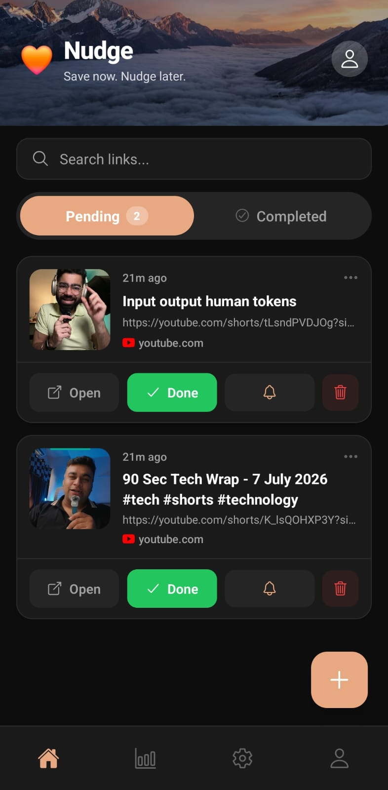

# Nudge - Universal Link Saving and Reminder Tool

A React Native mobile app built with Expo that allows you to save links from any app, set reminders, and stay organized.

## 📸 App Preview



## Features

✨ **Link Management**

- Save links from any app using the native Share Sheet
- Manually paste URLs or auto-detect from clipboard
- Fetch Open Graph metadata (title, image, description)
- Organize links with priority levels (Important, Normal, Someday)

📱 **Smart Reminders**

- Set reminders: In 1 Hour, Tonight at 8 PM, Tomorrow at 9 AM, or Custom
- Local push notifications integrated with expo-notifications
- Snooze functionality for pending links
- Weekly digest notification every Sunday

🎨 **User Experience**

- Light and Dark theme support
- Two-tab interface (Pending & Completed)
- Beautiful link cards with thumbnails
- Fully offline with no backend required

💾 **Local Storage**

- All data stored locally using expo-sqlite
- No cloud syncing or external dependencies
- Complete privacy - your links stay on your device

## Getting Started

### Prerequisites

- Node.js (v16 or higher)
- npm or yarn
- Expo CLI: `npm install -g expo-cli`

### Installation

1. Clone the repository or navigate to the project directory
2. Install dependencies:

```bash
npm install
```

3. Start the development server:

```bash
npx expo start
```

4. Open the app:
   - iOS: Press `i` to open in iOS Simulator
   - Android: Press `a` to open in Android Emulator
   - Web: Press `w` to open in web browser

## Project Structure

```
Nudge/
├── src/
│   ├── screens/
│   │   └── HomeScreen.tsx          # Main home screen with tabs
│   ├── components/
│   │   ├── LinkCard.tsx            # Individual link card component
│   │   ├── AddLinkModal.tsx        # Modal for adding new links
│   │   ├── ReminderPicker.tsx      # Reminder selection interface
│   │   ├── SettingsModal.tsx       # Settings panel
│   │   └── LinksList.tsx           # List container for links
│   ├── hooks/
│   │   └── useLinks.ts             # Custom hook for link management
│   ├── context/
│   │   └── ThemeContext.tsx        # Theme provider and hook
│   ├── utils/
│   │   ├── database.ts             # SQLite database operations
│   │   ├── metadata.ts             # Open Graph metadata fetching
│   │   ├── notifications.ts        # Notification scheduling
│   │   └── clipboard.ts            # Clipboard utilities
│   └── constants/
│       ├── theme.ts                # Light and dark theme definitions
│       └── index.ts                # App constants
├── App.tsx                         # Main app entry point
├── app.json                        # Expo configuration
├── package.json                    # Dependencies and scripts
└── tsconfig.json                   # TypeScript configuration
```

## Usage

### Adding a Link

1. Tap the **+** button at the bottom right
2. Paste or type a URL
3. Select priority (Important, Normal, or Someday)
4. The app automatically fetches metadata
5. Tap "Add" to save

### Setting a Reminder

1. After adding a link or tap **Snooze** on existing link
2. Choose: No Reminder, In 1 Hour, Tonight, Tomorrow, or Custom
3. For custom reminders, select date and time
4. Tap **Confirm** to schedule the notification

### Managing Links

- **Pending Tab**: Shows unsaved links with action buttons
  - **Open**: Opens the link in your browser
  - **Done**: Marks as complete and moves to Completed tab
  - **Snooze**: Updates or sets a new reminder
  - **Delete**: Permanently removes the link

- **Completed Tab**: Shows finished links
  - **Open**: Opens the link again
  - **Delete**: Removes from completed list

### Settings

- **Dark Mode**: Toggle between light and dark themes
- **Weekly Digest**: Enable/disable Sunday reminder notifications
- **Clear Completed**: Delete all links from the Completed tab

## Key Technologies

- **React Native**: Cross-platform mobile development
- **Expo**: Simplified React Native development
- **TypeScript**: Type-safe development
- **expo-sqlite**: Local database storage
- **expo-notifications**: Local push notifications
- **expo-clipboard**: Clipboard access
- **axios**: HTTP client for metadata fetching
- **react-native-receive-sharing-intent**: Share Sheet integration

## Error Handling & Resilience

The app handles runtime scenarios gracefully to ensure a robust user experience:

- **Network Failures**: Offline fallback allows link saving even when metadata fetching fails.
- **Invalid Input**: Built-in URL validation and auto-protocol normalization.
- **System Permissions**: Graceful fallback handles notification and clipboard permission denials.


## ⚙️ Architecture & System Design

### 📶 Offline-First Design
Nudge is built to work completely offline without relying on external cloud servers:
- **Local Database**: All user data, settings, and links are stored locally on the device using `expo-sqlite`.
- **Local Notifications**: Reminder scheduling uses `expo-notifications` directly on the operating system level.
- **Native Sharing**: Share sheet integration connects directly with the native iOS/Android sharing mechanics.

### ⚡ Performance & Optimization
- **Optimized Network Fetching**: Open Graph metadata fetching is limited by a 5-second timeout to prevent lag.
- **Cached Asset Fallbacks**: Fast image loading with local placeholder fallbacks for custom/missing OG images.
- **Efficient DB Operations**: SQLite queries are optimized and indexed to ensure minimal query latency.

## Future Enhancements

Potential features for future versions:

- Export/import links
- Link categories or tags
- Search and filter functionality
- Link statistics and analytics
- iCloud sync (optional)
- Browser extensions
- Web app companion

## Troubleshooting

### Links not appearing

- Check that the database initialized correctly
- Clear app cache and reinstall

### Notifications not working

- Verify notification permissions are granted
- Check that reminders are actually set
- On Android, ensure notifications are not blocked

### Metadata not fetching

- Check internet connection
- Website may not have proper OG tags
- Try adding the link manually

### Dark mode not working

- Ensure ThemeProvider wraps the entire app
- Check that theme context is properly initialized

## Support

For issues or feature requests, please open an issue in the repository.

## License

This project is open source and available under the MIT License.

## Contributing

Contributions are welcome! Please feel free to submit a Pull Request.

---

Built with ❤️ using React Native and Expo
